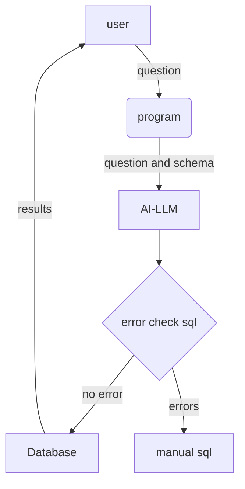

# llm-creates-sql
## LLM to create sql query using plain English request

## Overview
Problem: Structured data within applications contains essential operational and financial details. Accessing this information consistently necessitates IT assistance for the formulation of queries. Typically, query input formats require multiple parameters.

## Solution: 
Users can then pose questions in plain English, which will be translated into SQL (structured query language) queries using Retrieval Augmented Generation (RAG). These queries will retrieve information from structured data within applications.

DataJoin.net provides in-depth education and consultation on integration of Large Language Models (LLM) for query development with Customer Relationship Management (CRM) and Enterprise Resource Planning (ERP) systems.

## Fundamentals of LLM to generate SQL
In SQL schema, data is stored in multiple tables, a table has multiple columns. Typically, a table represents, and entity and columns are attributes of an entity.  Since in real world, entities have relationships with other entities, table columns have relationships to other tables using foreign keys.  It is possible that the names of tables and their columns are “normal” English words, however, in some cases the names can be abbreviation or not truly representing an entity. End user wants to ask a question in plain English; however, a programmer must translate English into SQL. This task is done by LLM. This is not 100% accurate at this point.

## Basic steps
Submit a question and SQL schema to LLM  
LLM return SQL that can answer the question  
Check if SQL syntax is correct  
Run the SQL for the database to produce results  

## Flowchart

Notes:  
question and schema(Call python program from VB for LLM.txt)  
AI-LLM(alm_openai_chatgpt_sql_v2.py)  
error check sql(check SQL from LLM and fine tune it.txt)  

## Topics list:  
Schema types  
Schema changes  
How LLM generate SQL  
local vs hosted (cloud) AI model LLM  
Access to (cloud) AI model LLM  
Download AI models  
Python codes  
 

